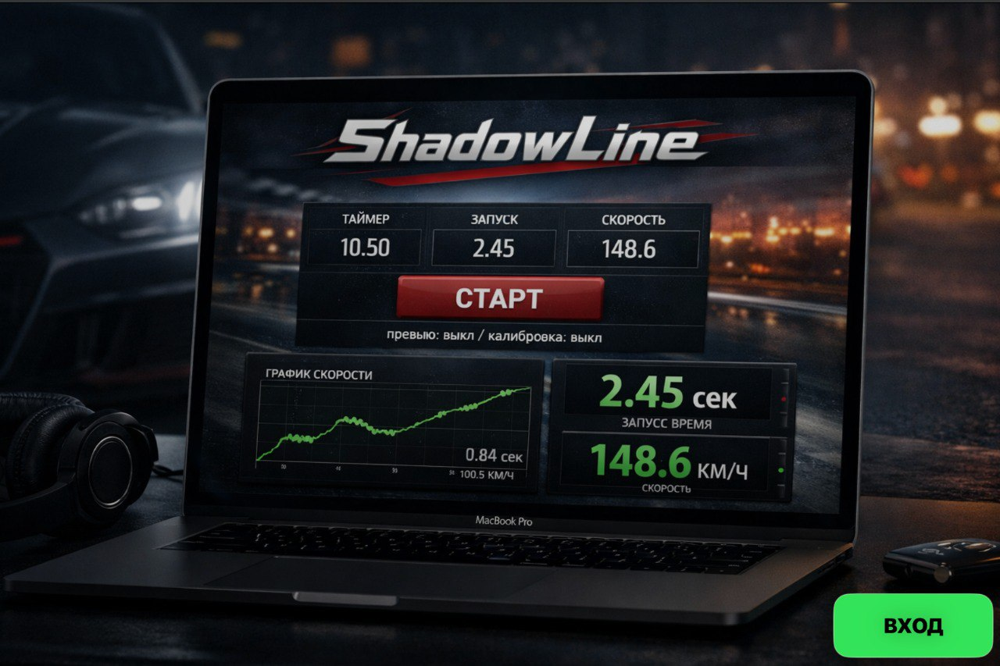

# 🏁 ShadowLine

**ShadowLine** — macOS-приложение для игроков *Drag Racing: Уличные гонки*.  
Помогает автоматизировать рутину, анализировать заезды и экономить время.

---

## 🚀 Основные возможности

### 🎮 Главное меню

---

### 🏎 Режим «Гонка»
- Таймер
- Анализ заезда
- Обучение переключениям
- Автостоп по финишу

---

### 🔢 Мои номера
- Русские номера
- Регионы
- Удобное управление

---

### ⛽ Скат бензина (ПДД)
- Полностью автоматический цикл
- Настраиваемые задержки
- Повтор по кругу

---

### 🔄 Откат КС
- Точные клики
- Тайминги
- Поддержка Telegram-уведомлений

---

## 📦 Установка

1. Перейди в **Releases**
2. Скачай `ShadowLine.dmg`
3. Перетащи приложение в **Applications**
4. При первом запуске выдай доступы macOS

---

## ⚠️ Важно
Приложение использует системные возможности macOS (клики, экран).  
Все действия выполняются **локально**.

---

## 🖥 Платформа
- macOS 12+
- Apple Silicon / Intel

---

## 📄 Лицензия
Для личного использования.
